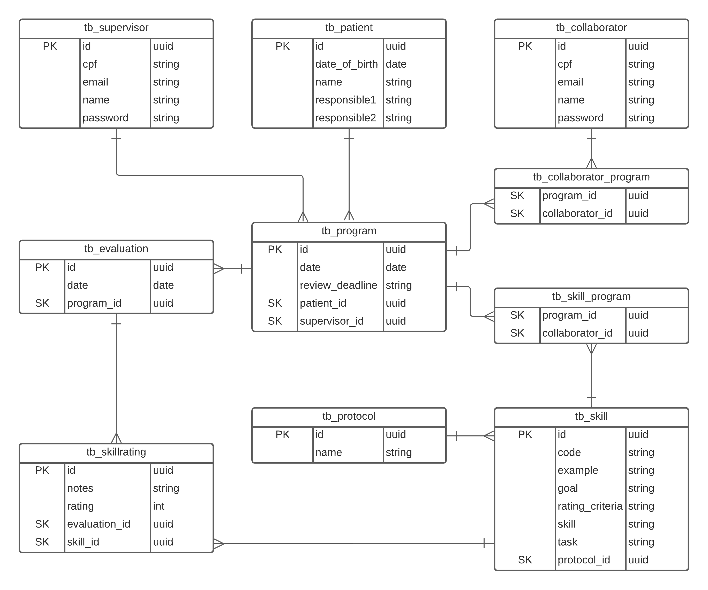
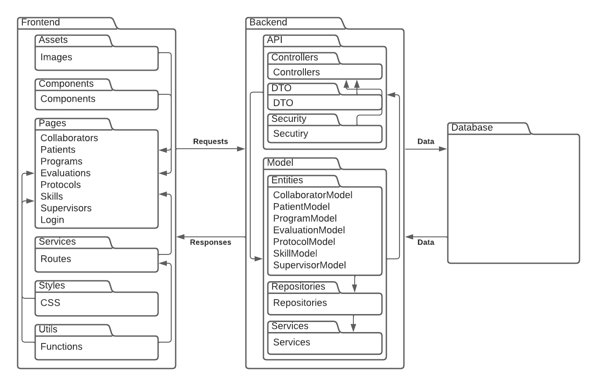
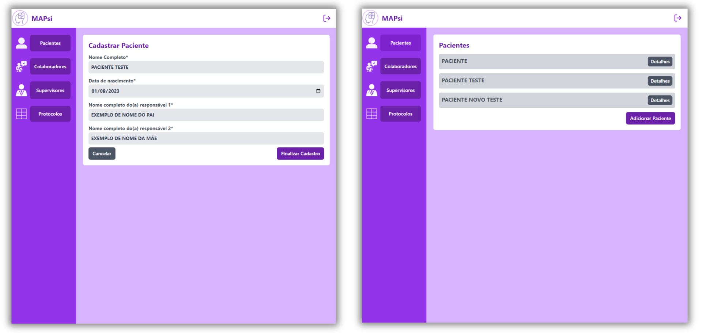
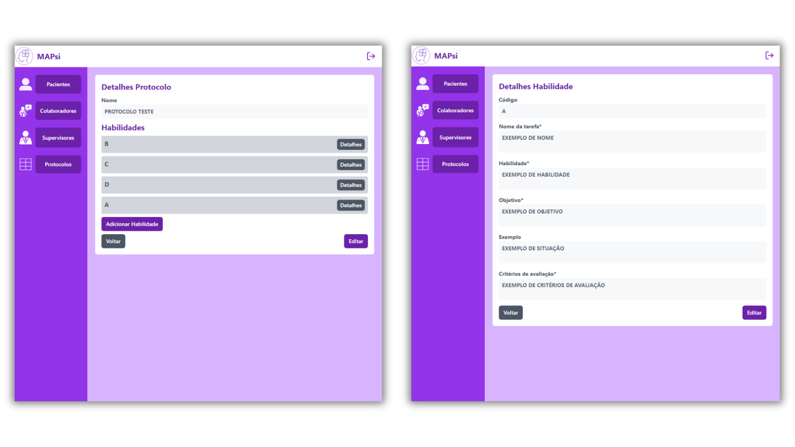
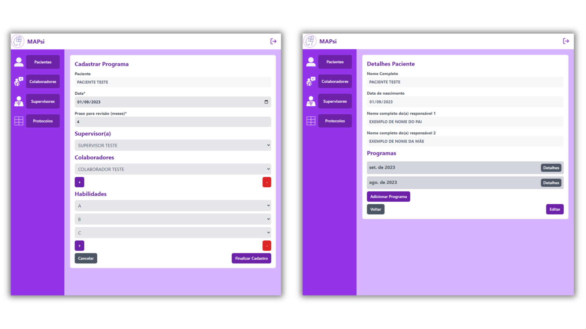
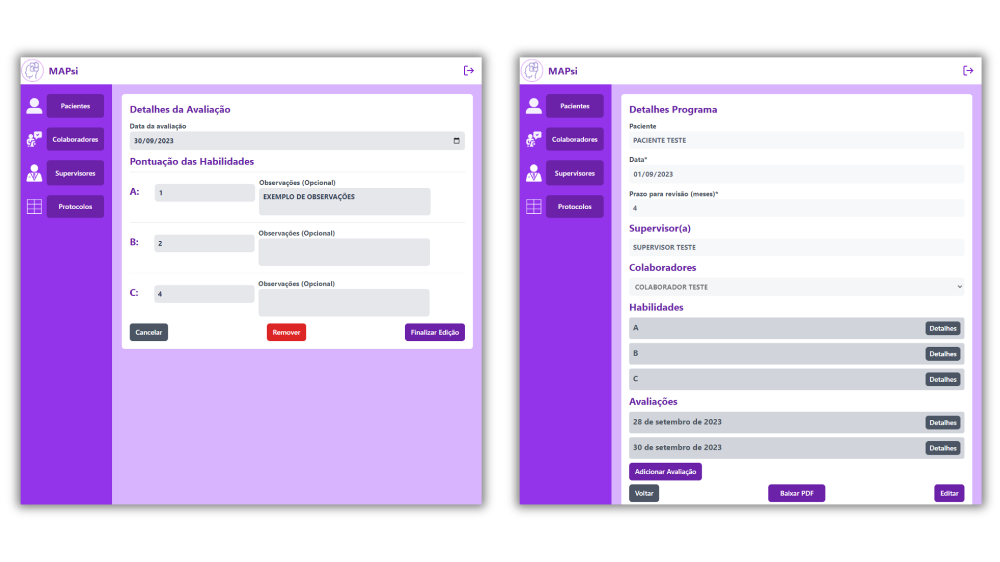
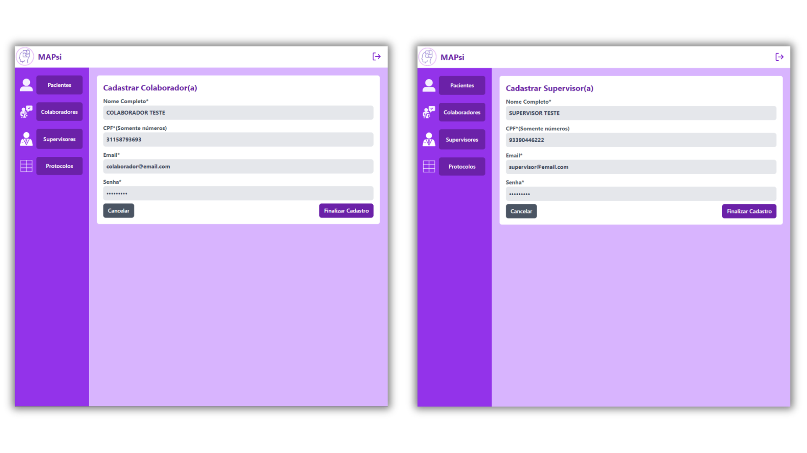
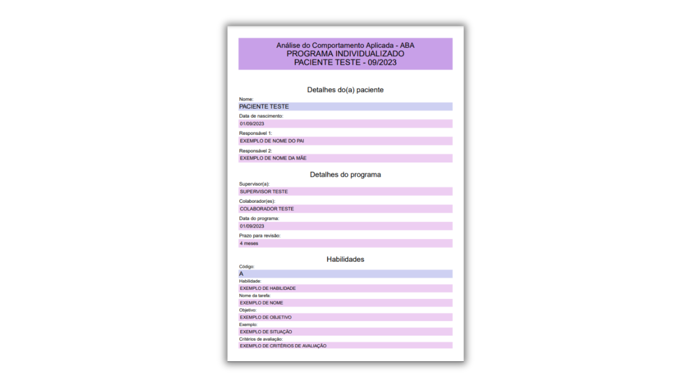
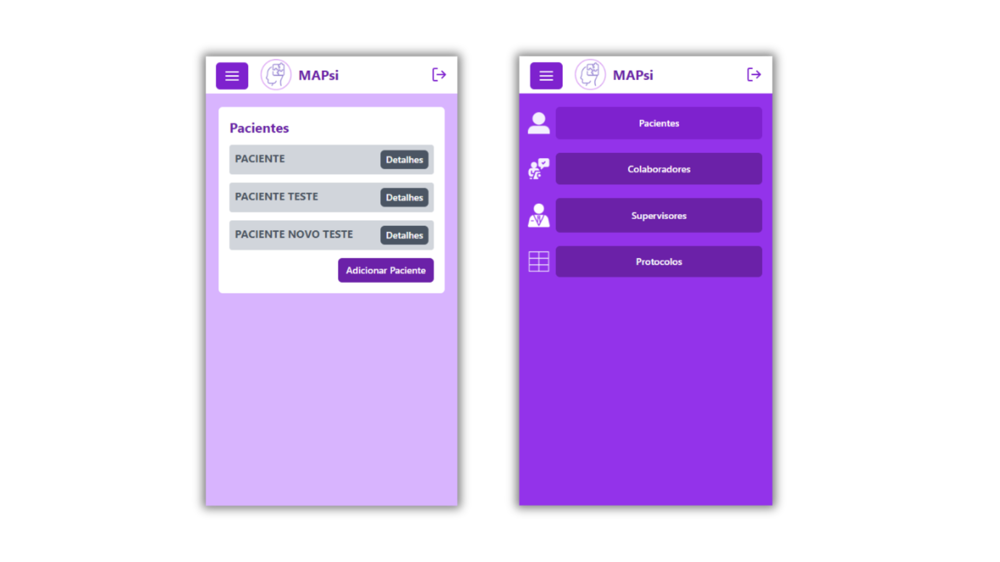

# MAPsi-repo

Repository of elements relating to the MAPsi project

## Summary

1. **Database**
   - Overview of the database structure including entities, relationships, and attributes.
2. **Package Architecture**
   - Description of the frontend and backend package structure detailing their respective components and functionalities.
3. **TAM Questions**
   - Evaluation questions based on the Technology Acceptance Model pertaining to different functionalities of the MAPsi system.
4. **Interface**
   - Detailed descriptions and visual representations of various interfaces within the MAPsi system including patient, protocol, program, evaluation, supervisor/collaborator, PDF generation, and mobile interfaces.

## Database

The figure below presents a diagram with all project entities, as well as their relationships, attributes and attribute types.

The elements presented in the database figure refer to the following parts:

- Supervisors:tb_supervisor;
- Patients: tb_patient;
- Collaborators: tb_collaborator;
- Programs: tb_program;
- Evaluations: tb_evaluation;
- Protocols: tb_protocol;
- Skills: tb_skill;
- Collaborators and programs relationship: tb_colalborator_program;
- Skills and programs relationship: tb_skill_program;
- Evaluation and skills relationship: tb_skillrating;

From these connections, it is visible that there are many "one-to-many" relationships in the model, with some exceptions in which the relationship must be "many-to-many" and the existence of an auxiliary entity is necessary to implement this relationship, as in list of programs and collaborators (“tb_program” and “tb_skill”), in which the entity "tb_skill_program" is responsible for storing the identifiers of both, enabling this relationship.

## Package architecture

For the [Frontend] subsystem:

- The [Assets] subpackage contains the images used in the interface, such as the system logo.
- In the [Components] subpackage are interface elements or components that are replicated on one or more screens, such as buttons or text boxes.
- The [Pages] subpackage contains the implementations of the pages to be displayed, as well as the structure in which they are organized.
- The [Services] subpackage contains the codes responsible for direct communication with the backend API.
- The [Styles] subpackage contains the CSS files responsible for styling the interface elements.
- The [Utils] subpackage implements auxiliary functions that are visible to the entire program.

For the [Backend] subsystem:

- In the [API] subpackage there are the packages: [Controllers], composed of elements responsible for receiving and handling frontend requests; [DTO], also known as data transfer objects, composed of elements that determine the structure of the entities that will be shared with the frontend or database; [Security], composed of elements responsible for the security of the application, such as password encryption.
- In the [Model] subpackage there are the following packages: [Entities], composed of elements that represent the project's model entities, together with their attributes and relationships; [Repositories], composed of elements called repositories that will indicate which functions the services will have;[Services], composed of elements called services that are responsible for defining the functions indicated by the repositories, it is in these functions that the project's business rules are implemented, for example the removal of a protocol culminates in the removal of all its abilities.

## TAM questions

Below are the questions asked for evaluation by the Technology Acceptance Model

Regarding the development of programs:

- Using the MAPsi system will facilitate the development of skills programs:
- The development of skills programs is:
- The development of skills programs in the MAPsi system was:
- Learning how to develop skills programs in the MAPsi system is:

Regarding the registration of evaluations

- Using the MAPsi system will facilitate recording patient assessments:
- The record of patient assessments is:
- The registration of patient assessments in the MAPsi system was:
- Learning how to record patient assessments in the MAPsi system is:

As for patients

- Using the MAPsi system will facilitate the recording of clinic patient data:
- The recording of patient data is:
- The registration of patients in the MAPsi system was:
- Learning how to register patients in the MAPsi system is:

As for collaborators

- Using the MAPsi system will facilitate the recording of data from clinic employees:
- The record of employee data is:
- The registration of employees in the MAPsi system was:
- Learning how to register employees in the MAPsi system is:

As for supervisors

- Using the MAPsi system will facilitate the recording of data from the company's supervisors:
- The data record of the company's supervisors is:
- The registration of supervisors in the MAPsi system was:
- Learning how to register supervisors in the MAPsi system is:

Regarding protocols

- Using the MAPsi system will facilitate the storage of protocols and their respective abilities:
- The record of protocols and their respective abilities is:
- The registration of protocols and skills in the MAPsi system was:
- Learning how to register protocols and skills in the MAPsi system is:

Regarding the MAPsi system

- In general, the system will be useful for the company's functionalities:
- In general, the use of the system is:
- In general, learning how to use the system is:

# Interface

## Patient interface

Regarding patients, it is possible to list, register and remove them from the system. To register patients, the software requests the following data: full name, date of birth, full name of two guardians, then it must register the patient in the database. Only a supervisor has the ability to add, change or remove patients from the system.

## Protocol interface

As for protocols, the software allows the registration of protocols which, in turn, must have a name and a set of skills with the elements presented in figure bellow. code (to reference the skill), skill (skill title), task ( necessary action), objective, example and evaluation criteria (indicating the grade values ​​for certain results). Only a supervisor has the ability to add, change, or remove protocols and skills from the system.

## Program interface

When dealing with programs, the software makes it possible to register and change programs for a patient. The programs contain all patient data, the name of the supervisor, the name(s) of the collaborator(s) responsible for that patient, the date on which the program was created, the deadline for that program (in months) and the selected skill codes, as well as the description of each selected skill. Only a supervisor has the ability to add, change, or remove programs from the software.

## Evaluation Interface

The system allows employees or supervisors to record the results for each skill that the patient performs with values ​​according to the description of the skill evaluation criteria. Assessments contain a list of all skills in the program, as well as grades and descriptions that can be assigned to each skill.

## Supervisor/Collaborator Interface

The interfaces for employees and supervisors are similar, requiring the same data for registration. This way, the software allows supervisors to register, providing their full name, email, CPF number and password. Only the software administrator user or another supervisor is able to register or change a supervisor's data.

Only a supervisor has the ability to add, change, or remove supervisors from the system. Furthermore, a supervisor can register employees, providing their full name, CPF number, email and password, or remove an existing employee. Changing an employee's data can be done by the employee or by the supervisor. It is observed that the system requires authentication for access from a login screen that requires email and password from a supervisor or employee already registered to access it.

## PDF generation

Collaborators have access to the programs in which they were linked, allowing them to view all their content. They can also register new assessments and download the program in PDF format. The downloaded program presents all the details and descriptions of all the skills registered in it.

## Mobile interface

MAPsi has responsiveness in its graphic elements to adapt to the most varied screen sizes, but in addition all screens have a dedicated interface for mobile devices, with changes in the graphic structure of the elements to facilitate use on touch screens.

